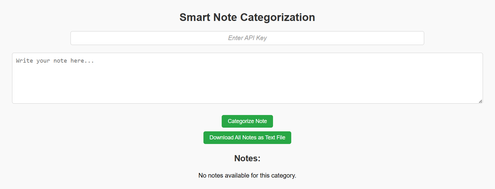
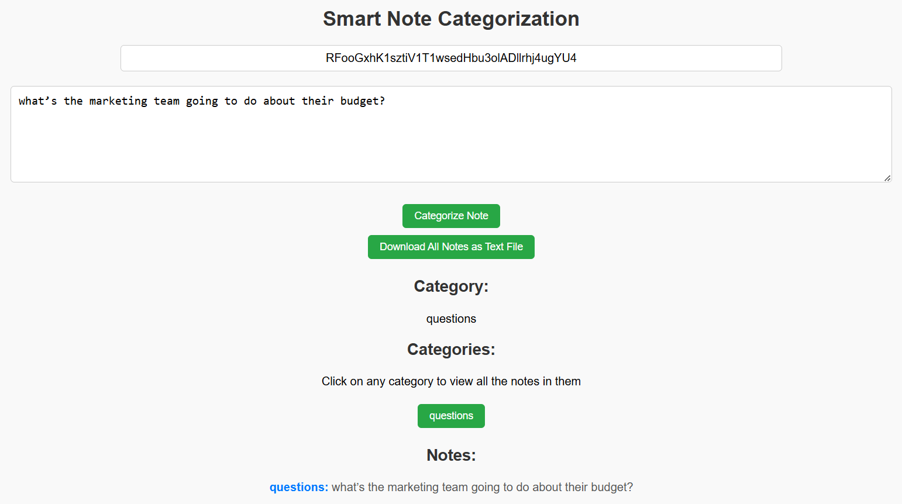
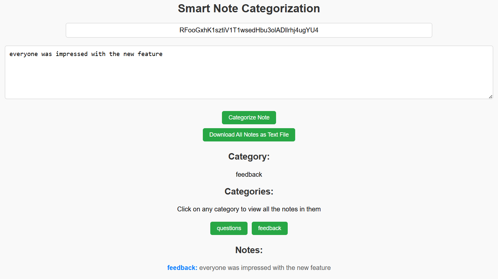
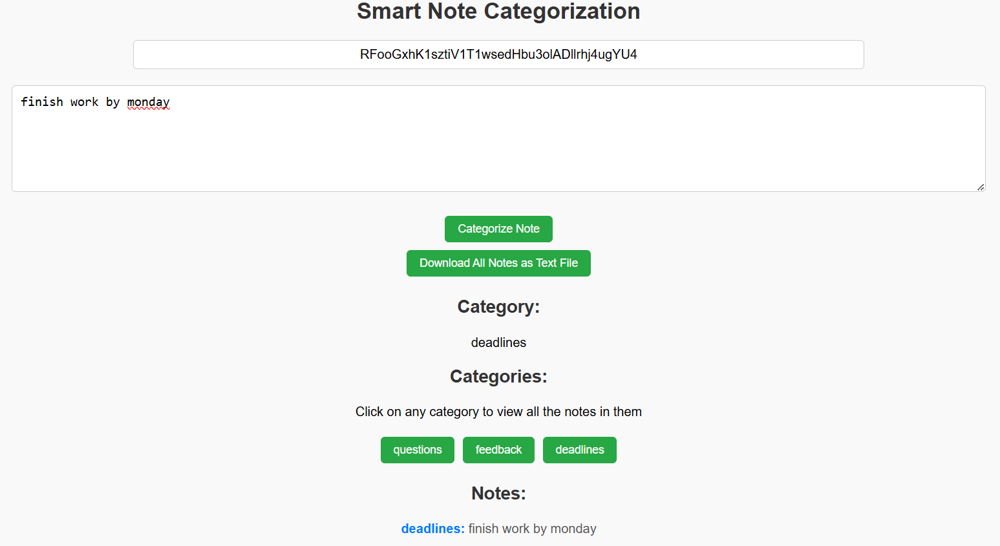
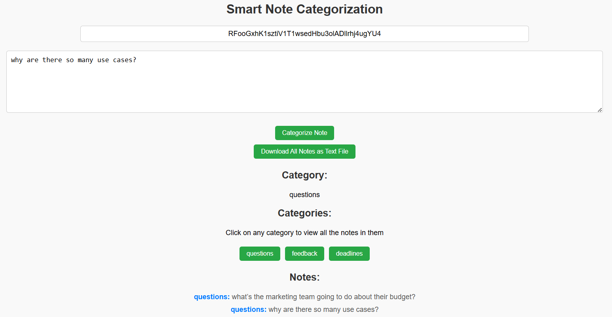
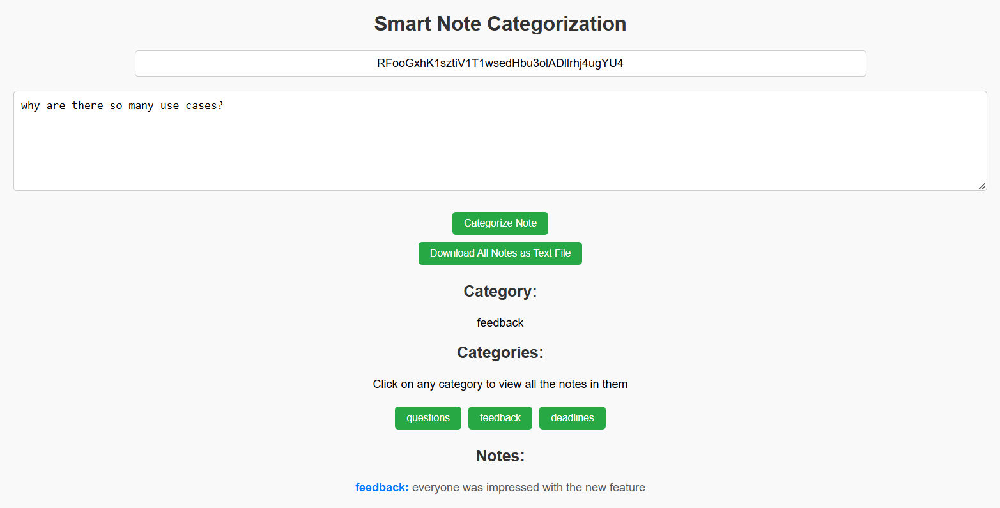
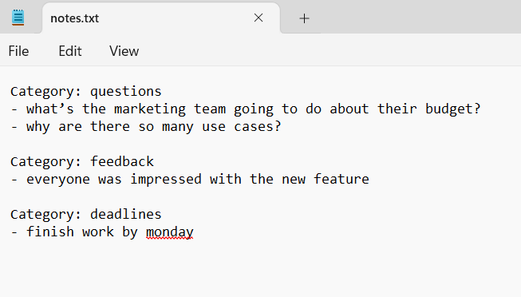

# SmartlyNotes

## App Platform
The app is designed for the web.

## Tech Stack
- For the backend, Node.js was used with an Express.js server.
- For the frontend, React.js was used with HTML/CSS styling.

## App Intro
Smartly Notes, effortlessly categorize your quick notes with smart AI.

## Tool Intro
[Cohere AI API](https://docs.cohere.com/v2/docs/command-r) 

## Functionality, Value, and Development Process
- Smartly Notes is a tool designed for quick note-taking sessions, ideal for meetings, brainstorming sessions, or any scenario where thoughts need to be quickly categorized and organized. By automatically categorizing notes using AI into relevant categories (questions, feedback, deadlines, announcements, ideas, and other), the app eliminates the need for manual tagging or sorting, allowing users to focus on the conversation instead of worrying about organizing their notes. Users are able to view the notes they took in each of the categories, and they can download all their notes (already organized into the relevant categories) as a text file.
- This app is perfect for students, professionals, team meetings, or personal brainstorming sessions where efficient note-taking and categorization are essential for effective decision-making and follow-up actions. It ensures that users can easily track and review the meeting’s key points without losing sight of important details.
- Additionally, the note entered by the user is passed as a prompt to the Cohere AI API for the AI to categorize the note into the relevant categories (questions, feedback, deadlines, announcements, ideas, and other). Thus, because an AI is performing the note categorization, its response may vary each time it is prompted (e.g. when the app is ran, the AI may categorize a certain note into the questions category, but when the app is reran, it may categorize the same note into a different category).
    - This is the prompt I use to send to the Cohere AI API: "Categorize this note into a relevant category (questions, feedback, deadlines, announcements, ideas, and other). Only mention the category, nothing else and no punctuation:\n\n${noteText}"

## How to Run (Locally):
### Initial Setup
- Clone this git repository

### Backend Setup
- Open a new terminal and cd into the backend folder
- Install dependencies:
`npm install express cors dotenv cohere-ai`
- Run the following line:
`node server.js`
- The express server should now be running

### Frontend Setup
- Open another terminal and cd into the frontend/notes-app folder
- Run the following line:
`npm start`
- The react server should now be running and your browser should open with the page on http://localhost:3000/

### Using the App
- Input a Cohere AI API key for their Command R model, delivered in August 2024. If you do not have one, you may input this one: 
`RFooGxhK1sztiV1T1wsedHbu3olADllrhj4ugYU4`
- Type a note in the text area and then click Categorize Note. Your note will be categorized into one of the following categories: questions, feedback, deadlines, announcements, ideas, or other.
- You may click the different categories to view all the notes in a specific category.
- When you are done writing your notes, you can download the notes as a text file.
- To start a set of new notes, stop and re-run the servers by going back into your terminals and typing CTRL + c and then follow the same steps to run them as before.
- Disclaimer: Because an AI is performing the note categorization, its response may vary each time it is prompted. The way it categorizes the notes also cannot be controlled.

### Example:
1. Initial page:  

2. After entering an API key and a note (question) and clicking 'Categorize Note':  

3. After entering a different note (feedback) and clicking 'Categorize Note':  

4. After entering a different note (deadline) and clicking 'Categorize Note':  

5. After entering a different note (question) and clicking 'Categorize Note':  

6. After clicking the 'feedback' category button:  

7. After clicking 'Download All Notes as Text File' and downloading the notes. This is the generated text file:  
